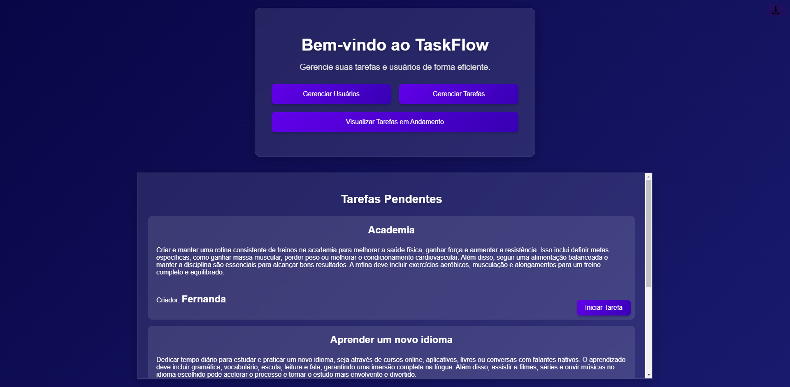
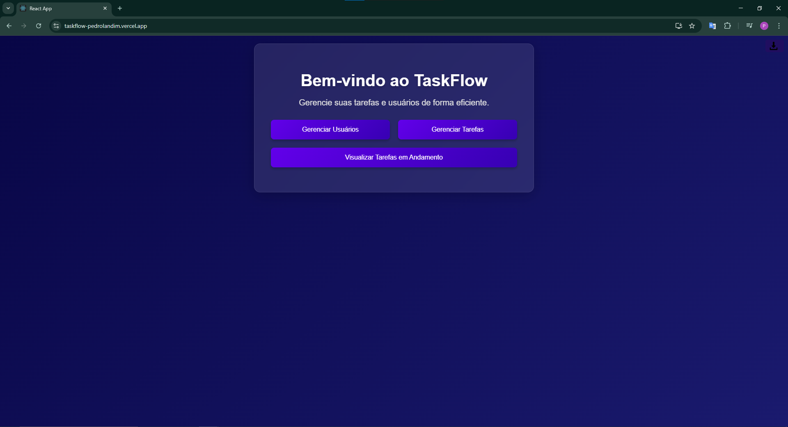
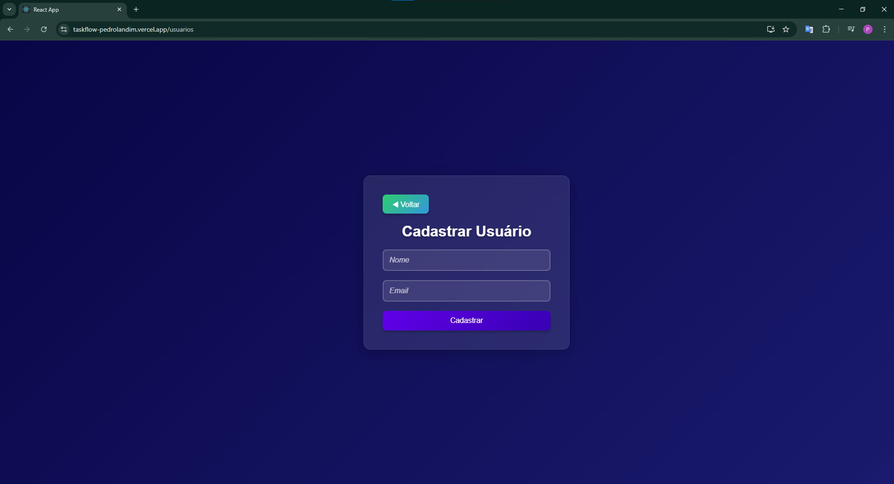
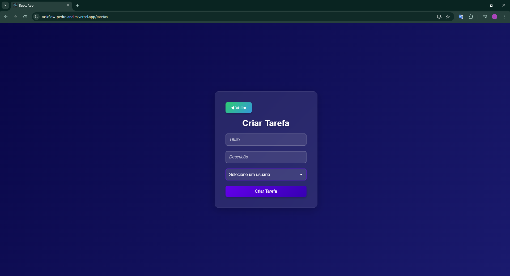

# TaskFlow - Sistema de Gerenciamento de Tarefas

 <!-- Adicione uma imagem do seu site aqui -->

TaskFlow é um sistema de gerenciamento de tarefas desenvolvido para ajudar equipes a organizar e acompanhar suas atividades de forma eficiente. O projeto consiste em um frontend em **React** e um backend em **FastAPI**, com deploy realizado no **Vercel** (frontend) e no **Render** (backend). Acesse o site [aqui](https://taskflow-pedrolandim.vercel.app/).

---

## 🚀 Funcionalidades

- **Cadastro de Usuários**: Cadastre novos usuários com nome e e-mail.
- **Gerenciamento de Tarefas**: Crie, edite, exclua e atualize o status de tarefas.
- **Status das Tarefas**: As tarefas podem ter os status "Pendente", "Em Andamento" ou "Concluído".
- **Exportação de Tarefas**: Exporte todas as tarefas para um arquivo JSON.

---

## 🛠️ Tecnologias Utilizadas

### Frontend (React)
- **React**: Biblioteca JavaScript para construção de interfaces.
- **Axios**: Para fazer requisições HTTP ao backend.
- **CSS**: Estilização dos componentes.

### Backend (FastAPI)
- **Python**: Linguagem usada para criação do backend.
- **FastAPI**: Framework Python para construção de APIs rápidas e modernas.
- **SQLAlchemy**: ORM para interação com o banco de dados.
- **PostgreSQL**: Banco de dados em nuvem para armazenamento de dados.

---

## 🚀 Deploy

O projeto está hospedado em duas plataformas:

- **Frontend**: Hospedado no [Vercel](https://vercel.com/). O site está disponível em: `https://taskflow-pedrolandim.vercel.app/`.
- **Backend**: Hospedado no [Render](https://render.com/). A API está disponível em: `https://taskflow-93vn.onrender.com/`.

---

## 🖼️ Visual do Site

### Página Inicial

### Lista de Tarefas

### Formulário de Cadastro de Usuário

### Formulário de Cadastro de Tarefas

---

## ✉️ Contato
Se tiver dúvidas ou sugestões, entre em contato:

### E-mail: plb3@cin.ufpe.br
